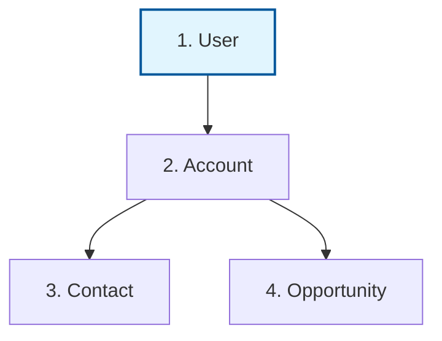

# 🛫 Salesforce Migration: Executive Flight Plan
**Prepared by**: Salesforce Migration Architect CLI
**Strategic Order**: User ➔ Account ➔ Contact ➔ Opportunity

---

## 🧩 1. Visual dependency Graph
**How to read this**: Each box is a mission-critical step. The arrows show dependencies. **Objects at the top of the chart must be loaded first.**

## 🚦 2. Steps of Execution (The Checklist)
Follow these phases strictly. Do not proceed to the next phase until the current one is 100% verified.
### 🏁 Phase 1: Foundation Setup

#### 📦 Step 1: **User** (User)
- [ ] **Extract**: Pull from legacy system / CSV source.
- [ ] **Map**: Ensure "External ID" is mapped for upserts.
- [ ] **Automation Off**: Disable Validation Rules & Disable Triggers/Flows (if high volume) & Check for Duplicate Rules.
- [ ] **Load**: Upload via Salesforce Bulk API.
- [ ] **Verify**: Confirm record counts match source.

#### 📦 Step 2: **Account** (Account)
- [ ] **Extract**: Pull from legacy system / CSV source.
- [ ] **Map**: Ensure "External ID" is mapped for upserts.
- [ ] **Automation Off**: Disable Validation Rules & Disable Triggers/Flows (if high volume) & Check for Duplicate Rules.
- [ ] **Load**: Upload via Salesforce Bulk API.
- [ ] **Verify**: Confirm record counts match source.

### 🏁 Phase 2: Data Enrichment

#### 📦 Step 3: **Contact** (Contact)
- [ ] **Extract**: Pull from legacy system / CSV source.
- [ ] **Map**: Ensure "External ID" is mapped for upserts.
- [ ] **Automation Off**: Disable Validation Rules & Disable Triggers/Flows (if high volume) & Check for Duplicate Rules.
- [ ] **Load**: Upload via Salesforce Bulk API.
- [ ] **Verify**: Confirm record counts match source.

#### 📦 Step 4: **Opportunity** (Opportunity)
- [ ] **Extract**: Pull from legacy system / CSV source.
- [ ] **Map**: Ensure "External ID" is mapped for upserts.
- [ ] **Automation Off**: Disable Validation Rules & Disable Triggers/Flows (if high volume) & Check for Duplicate Rules.
- [ ] **Load**: Upload via Salesforce Bulk API.
- [ ] **Verify**: Confirm record counts match source.

## 👥 3. Team "Who Does What?"
| Role | Primary Responsibility |
| :--- | :--- |
| **Lead Architect** | Approves sequence and data integrity signs-offs. |
| **Migration Crew** | Runs the actual loads; handles CSV errors. |
| **Business Lead** | Validates that fields mapped correctly to business needs. |

## ⚠️ 4. Risk Watchlist
1. **Parent Missing**: If Step 1 isn't perfectly clean, subsequent steps will fail.
2. **Automation Trap**: Validation Rules or flows must be toggled off or they will hit limits.